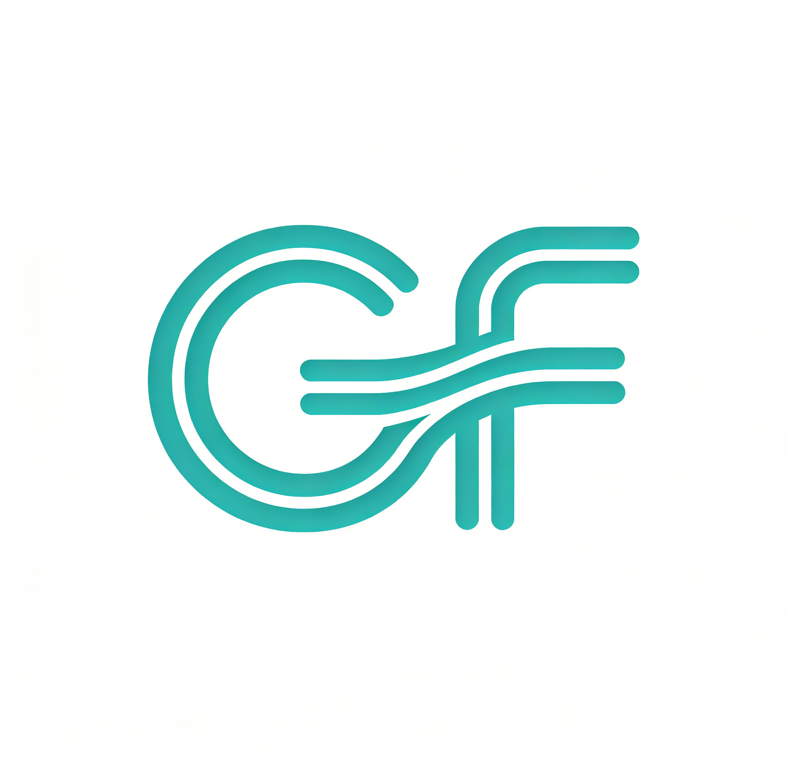
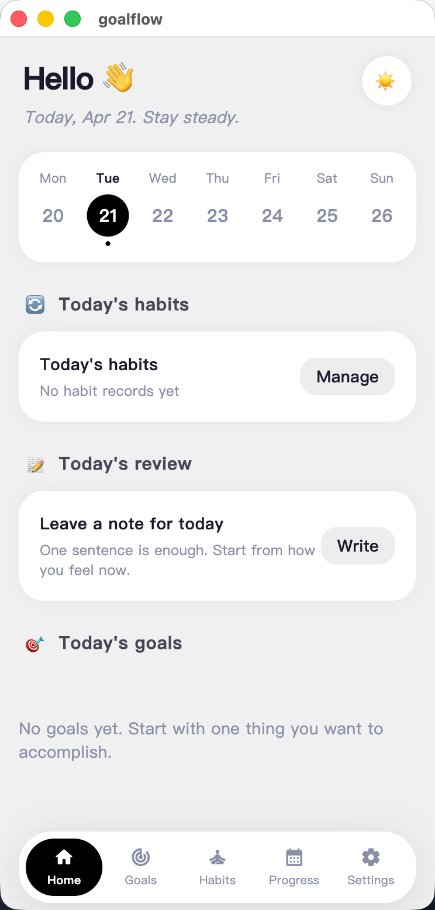
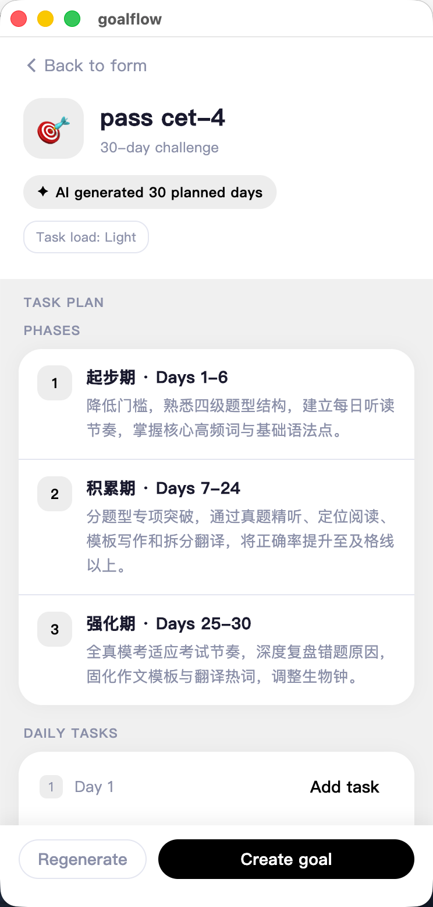
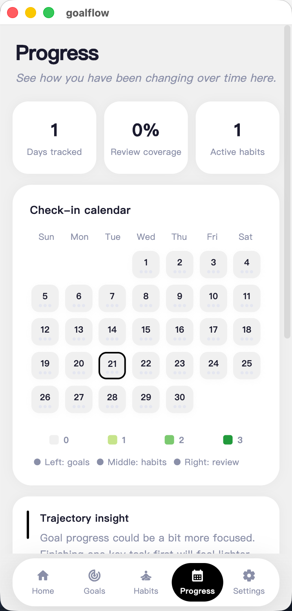
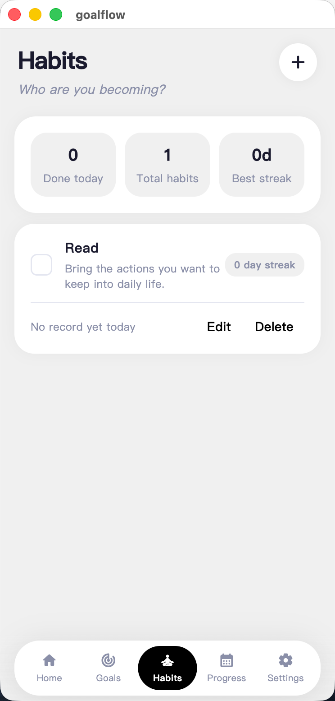

# GoalFlow

<p align="center">
  
</p>

<p align="center">
  <a href="#english">English</a> | <a href="#中文">中文</a>
</p>

<p align="center">
  
  
  
</p>

---

<a name="english"></a>
## 🇬🇧 English

GoalFlow is a recording system designed around personal growth. Unlike traditional apps that focus on "logging more," GoalFlow emphasizes minimal recording overhead while helping users drive results, shape identities, and understand their life trajectory.

### 🌟 Core Philosophy
GoalFlow focuses on three fundamental questions:
1. **Goals:** What do you want to achieve? (Result-oriented)
2. **Habits:** What kind of person do you want to become? (Identity-oriented)
3. **Reviews:** How do you understand your life? (Reflection-oriented)

### ✨ Features
- **AI-Powered Goal Decomposition:** Break down big goals into actionable daily tasks instantly.
- **Unified Trajectory View:** A chronological feed aggregating tasks, habits, and reflections.
- **Structured Daily Reviews:** Reflect on your day across four key dimensions.
- **Template Community:** Browse and use goal templates created by the community.

### 📱 Screenshots
<p align="center">
  
  
  
  
</p>

### 🚀 Quick Start
1. **Backend:**
   ```bash
   cd backend
   mvn -pl goalflow-api spring-boot:run -DskipTests
   ```
2. **Frontend:**
   ```bash
   flutter pub get
   flutter run
   ```

---

<a name="中文"></a>
## 🇨🇳 中文

GoalFlow 是一个围绕个人成长设计的记录系统。它的产品目标不是记录更多内容，而是用尽量低的记录成本，帮助用户持续推进结果、塑造长期身份、理解自己的生活轨迹。

### 🌟 核心理念
GoalFlow 只回答三个核心问题：
1. **目标：** 你想做成什么事？（结果导向）
2. **习惯：** 你想成为哪一种人？（身份导向）
3. **复盘：** 你如何理解自己的生活？（意义导向）

### ✨ 功能特性
- **AI 目标拆解：** 一键将宏大目标拆解为可落地的每日任务。
- **轨迹聚合视图：** 按日期聚合展示任务进度、习惯打卡与深度复盘。
- **结构化每日复盘：** 围绕四个核心维度对生活进行深度反思。
- **模板与榜单：** 发现并使用社区沉淀的优秀成长模板。

### 📱 界面预览
<p align="center">
  
  
  
  
</p>

### 🚀 快速开始
1. **后端启动：**
   ```bash
   cd backend
   mvn -pl goalflow-api spring-boot:run -DskipTests
   ```
2. **客户端启动：**
   ```bash
   flutter pub get
   flutter run
   ```

---

## 📄 License | 开源协议
This project is licensed under the **GNU General Public License v3.0**. See the [LICENSE](LICENSE) file for details.

本项目采用 **GNU General Public License v3.0** 开源协议。详情请参阅 [LICENSE](LICENSE) 文件。
